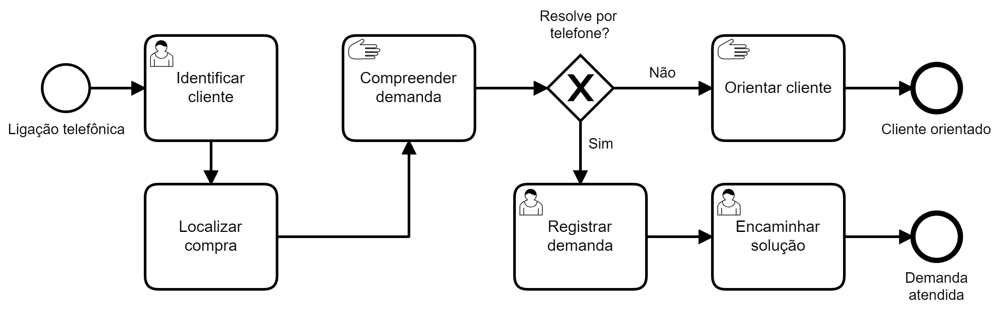

## Cenário

Contato inicial de cliente com Central de Atendimento ao Consumidor (CAC)
de uma empresa de alcance nacional, por exemplo, com foco em uma
compra (pós-venda).

## Modelagem BPMN

Operador da central atende consumidor, via telefone, e realiza a identificação do cliente e a localização da compra em questão.
Compreende a demanda do cliente e orienta o cliente, por exemplo,
ainda está dentro do prazo de entrega do produto ou, caso exija
ação correspondente, registra a demanda do cliente e encaminha
para o setor responsável. Em ambos os casos, finalizando o
processo de contato inicial.

