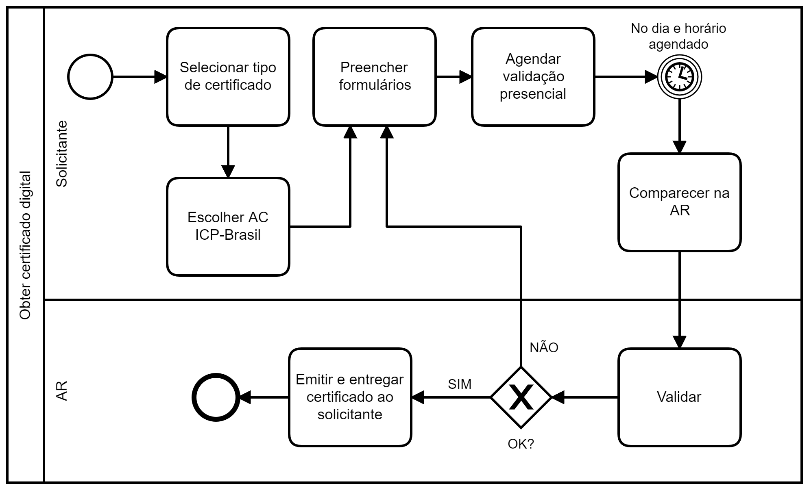

## Cenário

Processo clássico de aquisição de certificado digital, visão estratégica,
na qual participam o solicitante e uma Autoridade de Registro (AR).

## Modelagem BPMN

### Planejamento de ações semanais

O processo se inicia com a seleção do tipo de certificado, seguida da
escolha da Autoridade Certificadora (AC) de preferência do solicitante,
possivelmente com base no preço e na localização da AR, dentre outros
fatores. O solicitante então terá que efetuar o pagamento,
preencher formulários pertinentes e agendar validação presencial (há exceções).
No dia e horário agendados deve comparecer na AR em questão, que analisa
os formulários e documentos exigidos. Se há conformidade,
então a AR cuidará da emissão e, quando realizada, entrega do certificado
ao solicitante. Se houver não conformidade, possivelmente o solicitante
terá que preencher novamente formulários e continuar o processo a partir
deste preenchimento.

