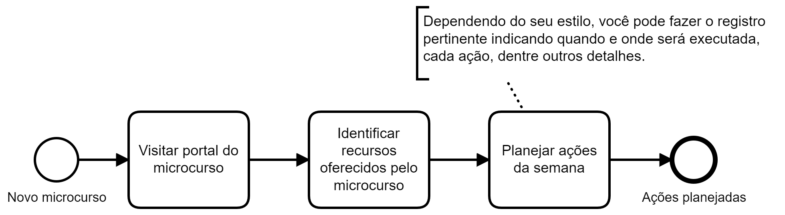
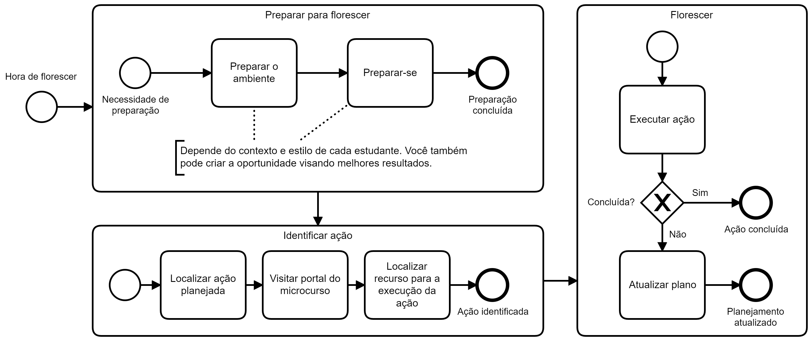

## Cenário

Modelagem de processos típicos a serem executados pelos estudantes
da Especialização em Saúde Digital (UFG/DATASUS).

## Modelagem BPMN

### Planejamento de ações semanais

Quando um novo microcurso é disponibilizado, espera-se que o estudante
visite o portal do microcurso (sítio específico), identifique os recursos
disponibilizados para o aprendizado do tópico em questão, o que em geral
inclui, texto, vídeos, questões e outras. Tendo em vista os recursos oferecidos, o estudante em questão deve organizar a sua semana de estudo
por meio de ações como ler, entender, assistir e outras, visando
aquisição de conhecimentos e habilidades promovidos pelo microcurso.

### Executar ação

O que foi planejado precisa ser realizado, item por item, ou ação por ação.
Abaixo a execução de cada ação é dividida em três subprocessos: (a) preparar
para florescer; (b) identificar ação e (c) florescer (a execução da ação).

Sim, aprender aqui é sinônimo de florescer, o que está ligado à satisfação, e
o oposto de "no pain no gain". Isto é promoção do seu bem-estar.

