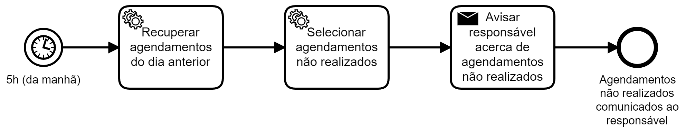

## Cenário

Pacientes são acompanhados durante tratamento de longa
duração e, aqueles "atrasados" conforme calendário previamente
estabelecido devem chamar atenção de responsável.

## Modelagem (BPMN)

A cada novo dia, em horário anterior ao início do expediente, automaticamente
são recupearados os agendamentos previstos no dia anterior. Na sequência são
identificados aqueles que não foram realizados, o que significa que a assistência prevista para os pacientes em questão não foram efetuadas.
Estes não realizados são encaminhados (mensagem) para o responsável.
O processo é concluído com a comunicação dos agendamentos não realizados
enviada para o responsável.

