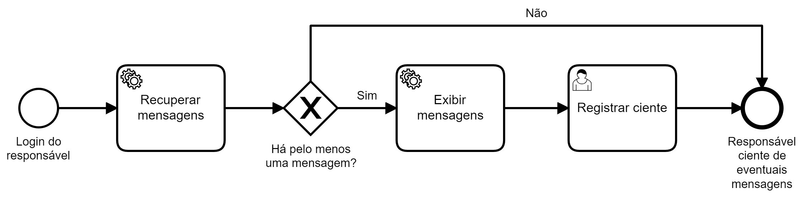

## Cenário

Pacientes são acompanhados durante tratamento de longa
duração e, aqueles "atrasados" conforme calendário previamente
estabelecido devem chamar atenção de responsável.

## Modelagem (BPMN)

A cada novo dia, em horário anterior ao início do expediente, automaticamente
são recuperados os agendamentos previstos no dia anterior. O símbolo no canto superior esquerdo da tarefa "Recuperar agendamentos do dia anterior" indica que se trata de uma tarefa automatizada. Na sequência são
identificados aqueles que não foram realizados, o que significa que a assistência prevista para os pacientes em questão não foi efetuada.
Estes não realizados são encaminhados (mensagem também automática) para o responsável, possivelmente por email, por exemplo.
O processo é concluído com a comunicação dos agendamentos não realizados
enviada para o responsável.

Observe que neste exemplo não são fornecidos "detalhes" acerca de como a mensagem é envida ao responsável. Podemos entender que o processo
está detalhado o suficiente para comunicar o que é relevante.
Por outro lado, pode ser imprescindível para o negócio certificar-se de
que o responsável recebeu as mensagens de agendamento não realizados.
Neste caso, isto pode ser feito conforme abaixo, em um outro processo,
indicando que o responsável só irá prosseguir com outras funções oferecidas pelo sistema em questão após registrar ciência das mensagens.

