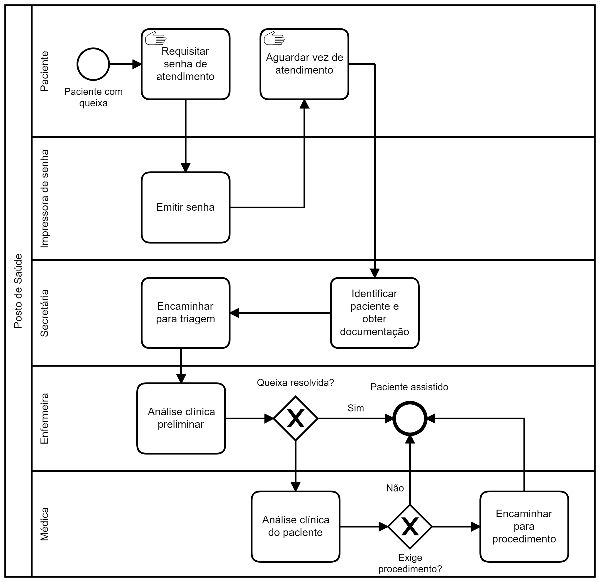

## Cenário

Paciente se apresenta em Posto de Saúde para atendimento.

## Modelagem BPMN

Ao chegar, o paciente requisita sua senha por meio de um quiosque digital,
também conhecido por totem, e aguarda ser chamado pela secretária, que
realiza a identificação e obtém documentos, por exemplo, de operadora de
plano de saúde. Posteriormente, a secretária encaminha para a triagem
realizada pela enfermeira. Este contato com a enfermeira pode ser
suficiente para esclarecer ou resolver a queixa, sem necessidade de
atenção imediata, ou seja, paciente é dado como atendido. Caso
contrário, encaminha para atenção posterior, realizada pela médica.
A análise da médica pode indicar necessidade de procedimento, cenário em
que o encaminhamento correspondente é feito, ou não. Neste último, o
paciente é considerado assistido.

