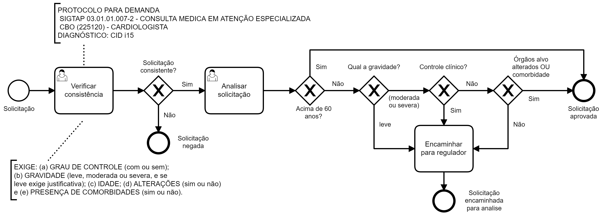

## Cenário

Protocolo de regulação para consulta com cardiologista para
diagnóstico CID i15.

## Modelagem (BPMN)

A solicitação tem sua consistência verificada, presença de elementos
obrigatórios conferida e, caso negativo, é negada. Nos demais casos
é analisada. A análise considera a idade, a gravidade, o controle
clínico, a presença de alterações em órgãos alvo e comorbidades.
Conforme as regras pertinentes, a solicitação é encaminhada para o
regulador ou aprovada.

