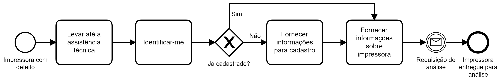
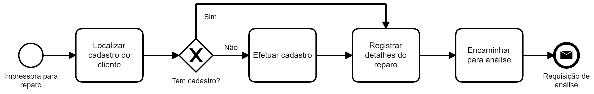

## Cenário

Cliente requisita reparo em impressora (assistência técnica).
Este cenário é modelado em duas perspectivas, uma do cliente e outra
da empresa que oferece o serviço.

## Modelagem BPMN (client)

Quando defeito é detectado em uma impressora, ela deve ser levada até a assistência técnica pelo cliente, que se identifica e, eventualmente
fornece detalhes para um cadastro. Também fornece informações que podem
ser relevantes para a detecção do problema. Após o registro destas
informações ele recebe a Requisição de análise (recibo) e o processo
é concluído. Agora terá que esperar pelo retorno da assistência técnica.

## Modelagem BPMN (empresa)

Ao receber o cliente a atendente o identifica e efetua o cadastro
correspondente, caso necessário. Na sequência registra os detalhes
pertinentes à impressora e a encaminha para a análise. Ao encaminhar
é produzida a Requisição de análise (recibo) que é entregue ao cliente
e também registra a demanda interna.

