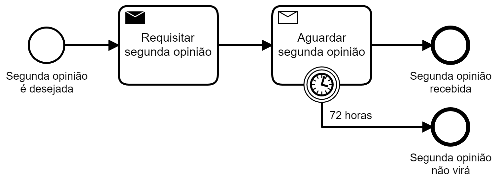

## Cenário

Um estabelecimento de saúde requisita segunda opinião e aguarda por
no máximo 3 dias, quando é assumido que a segunda opinião não será
fornecida.

## Modelagem (BPMN)

Este processo se inicia com a demanda de segunda opinião, que será encaminhada pela tarefa "Requisitar segunda opinião". Imediatamente o processo passa a aguardar pela segunda opinião. A tarefa que envia é identificado pela "carta" hachurada, aquela que espera por mensagem é a "carta" não hachurada. Observe que a tarefa "Aguardar segunda opinião" termina quando a mensagem (segunda opinião) for recebida ou quando for transcorrido o período de 72 horas, o que ocorrer primeiro. Neste último caso o processo assume que a segunda opinião "não virá".

